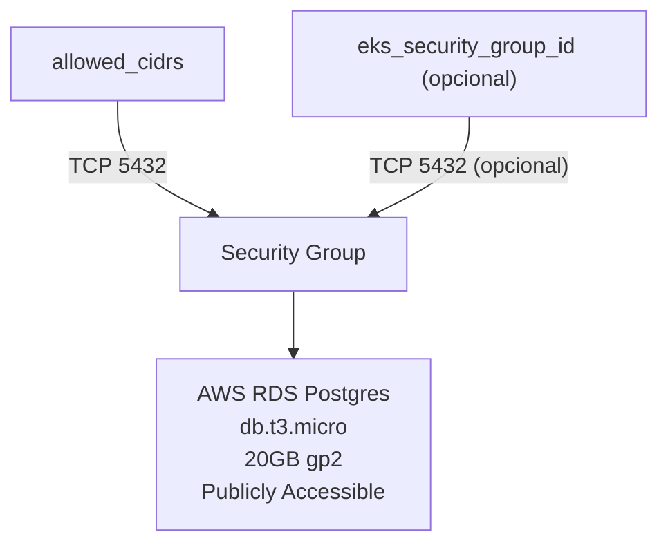

# Infraestrutura Database Mecanica Xpto

## Descrição

Este projeto provisiona uma instância **AWS RDS (Postgres) Free Tier** em `us-east-1` (Norte da Virgínia) com as seguintes características:
- Classe de instância `db.t3.micro`
- Armazenamento `gp2` de 20GB, sem autoscaling
- Acessibilidade pública habilitada para fácil acesso via DBeaver
- Security group permitindo `5432` de `allowed_cidrs` e opcionalmente de um SG do EKS
- Performance Insights desabilitado
- Banco de dados inicial `db-mecanica-xpto`
- Usuário `admin_user`, senha definida por variável (padrão fornecido)

### Arquivos
- `main.tf`: Provider, networking, security group e instância RDS
- `variables.tf`: Inputs com padrões seguros
- `outputs.tf`: Outputs de Endpoint, porta e usuário

## Tecnologias

- AWS RDS
- Terraform

## Arquitetura

- **Rede**: VPC padrão da AWS
- **Security Group**: Permite TCP 5432 de `allowed_cidrs` e opcionalmente de `eks_security_group_id`
- **RDS**: Postgres 17.6, db.t3.micro, 20GB gp2, público acessível
- **Outputs**: Endpoint, porta e usuário



## Como provisionar


1. Garanta que as credenciais da AWS estejam configuradas (ex: `AWS_PROFILE`, `AWS_ACCESS_KEY_ID`/`AWS_SECRET_ACCESS_KEY`).
```bash
aws configure
```
2. Navegue até o diretório do projeto e inicialize o Terraform:
```bash
cd infrastructure-mx-db
terraform init
```
3. Planeje e aplique as mudanças:
```bash
terraform plan
terraform apply
```

## Variáveis
- `aws_region`: padrão `us-east-1`
- `allowed_cidrs`: lista de CIDRs permitidos para acessar o Postgres (padrão `0.0.0.0/0` para simplicidade)
- `eks_security_group_id`: id opcional do SG do seu cluster EKS para permitir acesso ao DB
- `postgres_engine_version`: padrão `17.6`
- `initial_db_name`: padrão `db-mecanica-xpto`
- `postgres_username`: padrão `admin_user`
- `postgres_password`: padrão definido como `U2VuaGExMjM=` (conforme fornecido)

Você pode sobrescrever via CLI:

```bash
terraform apply \
	-var "allowed_cidrs=[\"SEU.IP.ADDR.0/24\"]" \
	-var "eks_security_group_id=sg-0123456789abcdef"
```

## Conectar via DBeaver
- Host: `mecanica-xpto-db.c6fuay2iwxil.us-east-1.rds.amazonaws.com`
- Porta: `5432`
- Banco de Dados: `db_mecanica_xpto`
- Usuário: `admin_user`
- Senha: `U2VuaGExMjM=`

## CI/CD (GitHub Actions)
- Arquivo de workflow: `.github/workflows/terraform.yml`
- Executa apenas no push para a `main` (i.e., após merge de PR).
- Passos: `terraform fmt`, `validate`, `plan` e `apply` automático para produção.
- Acesso AWS: configure `Secrets`:
	- `AWS_ROLE_TO_ASSUME`: ARN da role IAM confiável para GitHub OIDC (recomendado).
	- Ou credenciais clássicas: `AWS_ACCESS_KEY_ID`, `AWS_SECRET_ACCESS_KEY` (remova `role-to-assume` no workflow nesse caso).

Exemplo para restringir acesso via variáveis (Plan/Apply pega estes dos padrões ou sobrescritas):

```bash
terraform apply \
	-var "allowed_cidrs=[\"SEU.IP.ADDR.0/32\"]" \
	-var "eks_security_group_id=sg-0123456789abcdef"
```
